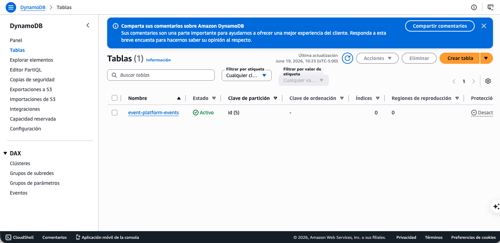
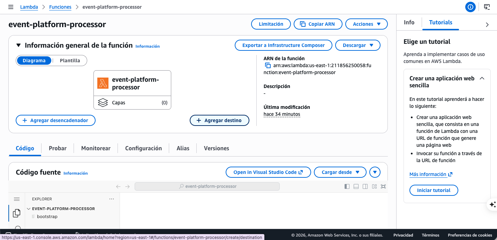
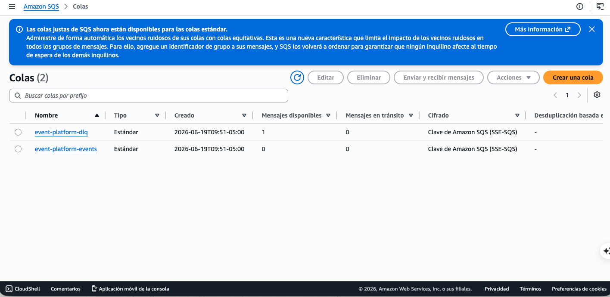
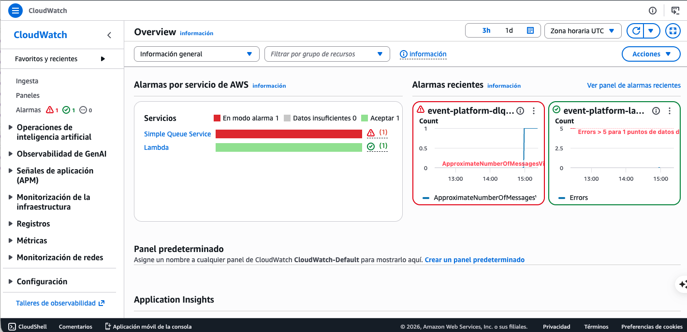

# Evidencia de funcionamiento (E2E)

Salidas reales del flujo completo desplegado en AWS (`us-east-1`). Cubre los
criterios de aceptación de
[`specs/event-platform.spec.md`](../specs/event-platform.spec.md).

## Contexto

- Región: `us-east-1`
- Endpoint: `https://x8568m1jrb.execute-api.us-east-1.amazonaws.com/events`
- Cuenta: `2118XXXXXXXX`
- Fecha de la prueba: 2026-06-19

---

## Caso 1 — Evento normal se procesa (AC-1)

```bash
curl -X POST "$ENDPOINT" -H 'content-type: application/json' \
  -d '{"id":"evt-demo-1","type":"pedido","payload":{"monto":50}}'
```

La API responde rápido (encola en SQS):
```xml
<SendMessageResponse>
  <SendMessageResult>
    <MessageId>846014b7-05aa-4be1-ba78-2e6bb4bb09de</MessageId>
  </SendMessageResult>
</SendMessageResponse>
```

Verificación en DynamoDB:
```bash
aws dynamodb get-item --table-name event-platform-events \
  --key '{"id":{"S":"evt-demo-1"}}'
```
```json
{
    "Item": {
        "payload":     { "S": "{\"monto\":50}" },
        "processedAt": { "S": "2026-06-19T14:56:12Z" },
        "id":          { "S": "evt-demo-1" },
        "type":        { "S": "pedido" }
    }
}
```

Log del procesador:
```
2026/06/19 14:56:13 evento evt-demo-1 procesado y guardado
```





---

## Caso 2 — Idempotencia (AC-2)

Mismo `id` otra vez:
```bash
curl -X POST "$ENDPOINT" -H 'content-type: application/json' \
  -d '{"id":"evt-demo-1","type":"pedido","payload":{"monto":50}}'
```

El procesador detecta el duplicado y no lo vuelve a guardar:
```
2026/06/19 14:59:20 evento evt-demo-1 ya estaba procesado, lo ignoro (idempotencia)
```
En DynamoDB sigue habiendo un solo item.

---

## Caso 3 — Fallo, reintentos y DLQ (AC-3 / AC-4)

Evento venenoso:
```bash
curl -X POST "$ENDPOINT" -H 'content-type: application/json' \
  -d '{"id":"poison-demo-1","forceFail":true}'
```

El procesador falla en cada intento (3 reintentos, ~60s entre cada uno por el
visibility timeout):
```
2026/06/19 14:56:13 fallo procesando messageId=431ab391-...: forceFail activo para el evento poison-demo-1
2026/06/19 14:57:14 fallo procesando messageId=431ab391-...: forceFail activo para el evento poison-demo-1
2026/06/19 14:58:13 fallo procesando messageId=431ab391-...: forceFail activo para el evento poison-demo-1
```

Tras agotar los reintentos, el mensaje cae en la DLQ:
```bash
aws sqs get-queue-attributes --queue-url "$DLQ" \
  --attribute-names ApproximateNumberOfMessages
```
```json
{ "Attributes": { "ApproximateNumberOfMessages": "1" } }
```



---

## Caso 4 — Alarma y alerta (AC-5)

La métrica de la DLQ cruza el umbral y la alarma pasa a `ALARM`:
```bash
aws cloudwatch describe-alarms --alarm-name-prefix event-platform \
  --query 'MetricAlarms[].{Nombre:AlarmName,Estado:StateValue}'
```
```
event-platform-dlq-not-empty   ALARM
event-platform-lambda-errors   OK
```

> Nota: `lambda-errors` se queda en `OK` a propósito. El procesador no se cae
> con el venenoso: lo maneja con `ReportBatchItemFailures` y reporta solo ese
> mensaje como fallido, así que la métrica de errores de la función es 0.

La alarma notifica por SNS → correo al operador (`abytecorp@gmail.com`).



---

## Teardown (AC-6)

```bash
./scripts/teardown.sh
```

Esperado: `Destroy complete!` — no quedan recursos facturables.
