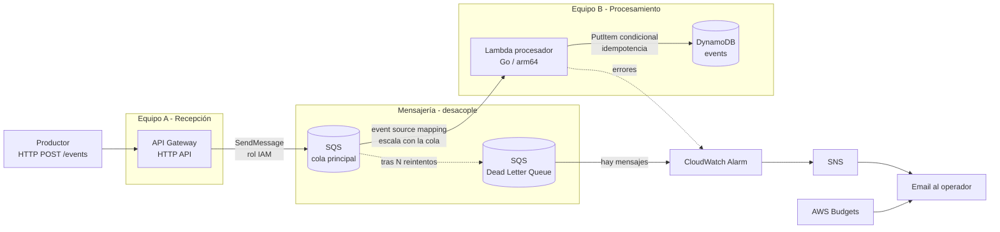

# Diagrama de arquitectura

Flujo end-to-end. Lo importante: **recepción y procesamiento están separados por
una cola durable**, así que cada lado escala y se despliega solo.

## Cómo leerlo

1. El **productor** hace `POST /events`.
2. **API Gateway** escribe el cuerpo directo en **SQS** usando un rol IAM (sin
   compute nuestro de por medio): aceptamos rápido y el evento ya está a salvo
   en una cola durable.
3. El **Lambda en Go** consume de la cola, escala según cuántos mensajes haya, y
   guarda en **DynamoDB** con escritura condicional (idempotencia).
4. Si un mensaje falla `N` veces, SQS lo manda a la **DLQ**.
5. **CloudWatch** vigila la DLQ y los errores; avisa por **SNS → email**.
6. **AWS Budgets** avisa si el gasto se acerca al tope.

> Fuente editable: este mismo bloque Mermaid. Si prefieres, se puede exportar a
> PNG/SVG desde [mermaid.live](https://mermaid.live) o recrear en
> draw.io/excalidraw con las mismas cajas.
